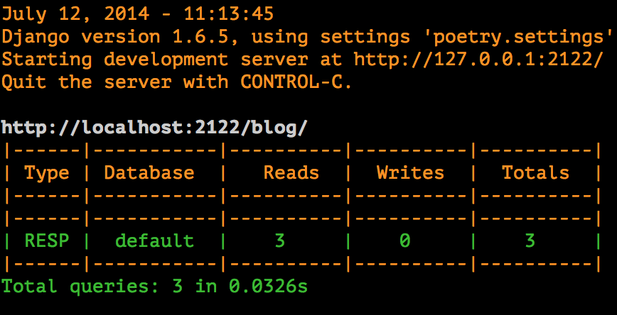

Django Querycount
=================

|version| |license|

Inspired by `this post by David Szotten <http://goo.gl/UUKN0r>`_, this project
gives you a middleware that prints DB query counts in Django's runserver
console output.

|screenshot|

Installation
------------

    pip install django-querycount

Just add ``querycount.middleware.QueryCountMiddleware`` to your
``MIDDLEWARE``.

Notice that django-querycount is hard coded to work only in DEBUG mode set to true

Settings
--------

There are two possible settings for this app: The first defines threshold
values used to color output, while the second allows you customize requests
that will be ignored by the middleware.  The default settings are::

    QUERYCOUNT = {
        'THRESHOLDS': {
            'MEDIUM': 50,
            'HIGH': 200,
            'MIN_TIME_TO_LOG':0,
            'MIN_QUERY_COUNT_TO_LOG':0
        },
        'IGNORE_REQUEST_PATTERNS': [],
        'IGNORE_SQL_PATTERNS': [],
        'DISPLAY_DUPLICATES': None,
        'RESPONSE_HEADER': 'X-DjangoQueryCount-Count'
    }

The ``QUERYCOUNT['THRESHOLDS']`` settings will determine how many queries are
interpreted as high or medium (and the color-coded output). In previous versions
of this app, this settings was called ``QUERYCOUNT_THRESHOLDS`` and that setting
is still supported.

The ``QUERYCOUNT['IGNORE_REQUEST_PATTERNS']`` setting allows you to define a list of
regexp patterns that get applied to each request's path. If there is a match,
the middleware will not be applied to that request. For example, the following
setting would bypass the querycount middleware for all requests to the admin::

    QUERYCOUNT = {
        'IGNORE_REQUEST_PATTERNS': [r'^/admin/']
    }

The ``QUERYCOUNT['IGNORE_SQL_PATTERNS']`` setting allows you to define a list of
regexp patterns that ignored to statistic sql query count. For example, the following
setting would bypass the querycount middleware for django-silk sql query::

    QUERYCOUNT = {
        'IGNORE_SQL_PATTERNS': [r'silk_']
    }

The ``QUERYCOUNT['RESPONSE_HEADER']`` setting allows you to define a custom response
header that contains the total number of queries executed. To disable this header, 
the supply ``None`` as the value::

    QUERYCOUNT = {
        'RESPONSE_HEADER': None
    }

**New in 0.4.0**. The ``QUERYCOUNT['DISPLAY_DUPLICATES']`` setting allows you
to control how the most common duplicate queries are displayed. If the setting
is ``None`` (the default), duplicate queries are not displayed. Otherwise, this
should be an integer. For example, the following setting would always print the
5 most duplicated queries::

    QUERYCOUNT = {
        'DISPLAY_DUPLICATES': 5,
    }

License
-------

This code is distributed under the terms of the MIT license.

Testing
-------

Run `python manage.py test querycount` to run the tests. Note that this will
modify your settings so that your project is in DEBUG mode for the duration
of the `querycount` tests.

(side-note: this project needs better tests; for the moment, there are only
smoke tests that set up the middleware and call two simple test views).

Contributing
------------

Bug fixes and new features are welcome! Fork this project and send a Pull Request
to have your work included. Be sure to add yourself to ``AUTHORS.rst``.

.. |version| image:: http://img.shields.io/pypi/v/django-querycount.svg?style=flat-square
    :alt: Current Release
    :target: https://pypi.python.org/pypi/django-querycount/

.. |license| image:: http://img.shields.io/pypi/l/django-querycount.svg?style=flat-square
    :alt: License
    :target: https://pypi.python.org/pypi/django-querycount/

